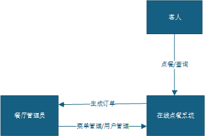

# 1. 引言

本文档为 OrderSphere‑Hub 在线餐厅点餐系统的软件需求规格说明（SRS）。本章对文档进行整体纵览，帮助读者清晰理解本文档的编写思路、组织结构、阅读方式与解释规则。

文档采用从整体到局部、从业务到技术的逻辑编写，依次覆盖系统概述、功能需求、非功能需求、接口与数据、部署与验收等内容，结构严谨、层次清晰、表述统一。读者可根据角色与目标定向查阅对应章节，快速定位核心信息。所有需求均遵循一致规范与优先级，具备唯一性、可理解性与可验证性，确保不同人员对需求的理解一致。本纵览旨在指导读者正确阅读、解释与使用本文档，作为后续开发、测试与验收的统一依据。

---

## 1.1 目标

OrderSphere‑Hub 是基于 Python + FastAPI + Vue3 + SQLite 技术栈构建的全栈 Web 在线点餐系统。本文档仅定义并覆盖该系统的核心业务子系统，包括：菜单展示、JSON 菜单自动导入、购物车、订单创建与查询、管理端扩展接口、开发环境一键启动、生产环境静态文件托管等功能模块。本文档不涉及系统以外的硬件设备、第三方支付、多门店连锁管理及其他未提及的子系统或外部组件。

---

## 1.2 文档约定

### 1.2.1 文档格式
用户文档为 USER_GUIDE ，请确保不要新建其他的markdown文件，注意推荐使用 Visual Studio Code 作为本文档的编辑器，并安装 .vscode/extensions.json 中推荐的拓展以获得最佳编辑体验。

### 1.2.2 标题格式
每个标题均由简短的几个字组成，向用户说明下一节内容的大致格式，且除首个大标题外，所有标题均应使用合理数量的#来指定合理的标题级别。

### 1.2.3 用语约定
| 对象                   | 用语                                                          |
|----------------------|-------------------------------------------------------------|
| 文档阅读者                | `您`                                                         |
| 本平台                  | `OrderSphere-Hub`                                           |
| 计算机知识丰富的 Geek / 专业用户 | `高级用户`                                                      |
| 用于演示的用户名称            | `ExampleUser1`、`ExampleUser2`、`SampleUser1`、`SampleUser2` 等 |
| 用于演示的料理 ID 和名称       | `#233 一个神奇的料理`、`#5 Demo Food`                               |  
如果您发明了一个新名词，请注意在不同地方使用时保持其一致性。

### 1.2.4 符号约定
- 用 `空格` 而不是 `Tab` 进行缩进
- 用 `enter` 进行换行， 若要使用无缝换行则在上一行尾部双击`空格`
- 空行不能包含空白字符，应该为单纯的 `\n\n`
- 在没有特殊说明的地方均使用半角符号，如: `:`，`.`，`<`，`>`，`(`，`)`。通常这些符号后面需要加上一个空格来确保间距合理
- 在文字段落中均采用 `，` 逗号，每句话结尾需添加 `。` 句号
- 列表条目、使用特定的代码框 等提示容器中的文本通常不以 `。` 结尾

### 1.2.5 文本间距与文本修饰
-在正常文本和半角标点之间应添加空格，半角标点和全角标点之间无需空格:  
-请注意遵守下方粗体或斜体的修饰字符规则

---

## 1.3 预期的读者和阅读建议

本文档预期读者包括项目管理人员、产品人员、后端开发工程师、前端开发工程师、测试工程师、运维部署人员。不同角色可根据自身工作内容，有侧重地阅读相应章节，以提高理解与使用效率。  
-项目管理人员 / 产品人员：建议通读全文，重点关注产品定义、功能需求、总体描述、验收标准，把握需求范围与目标。  
-后端开发工程师：重点阅读功能需求、接口需求、数据结构、数据库设计、部署与运行环境。  
-前端开发工程师：重点阅读功能需求、用户界面需求、API 接口规范、交互流程。  
-测试工程师：以功能需求、非功能需求、验收标准为核心，用于设计测试用例与验证结果。  
-运维部署人员：重点阅读运行环境、部署方式、依赖配置、生产环境托管要求。

所有读者在使用前应先阅读文档纵览与引言，明确文档结构、编写规范与解释规则，确保对需求理解一致。

---

## 1.4 产品的范围

`项目简单描述` OrderSphere-Hub 是一款基于 Python+FastAPI+Vue3+SQLite 技术栈开发的全栈在线点餐Web系统，聚焦单餐厅线上点餐核心场景，提供菜单展示（JSON自动导入）、购物车管理、订单创建与查询、管理员接口扩展等核心功能，支持开发环境一键启动、生产环境FastAPI托管前端静态文件，部署便捷、轻量易用，无需复杂配置即可快速落地使用。  
`项目利益` 为餐厅提供低成本、高效的线上点餐解决方案，减少人工点餐压力，提升点餐效率与用户体验；为管理员提供便捷的系统管理入口，简化菜单、订单管理流程；为开发、运维人员提供标准化、易部署的技术架构，降低开发与维护成本；为用户提供简洁、流畅的线上点餐体验，实现快速选餐、下单与订单查询。  
`项目目标` 开发一款功能完整、运行稳定、操作便捷的在线点餐系统，满足餐厅线上点餐核心需求；确保系统兼容性强、部署简单，适配主流浏览器与不同运行环境；实现菜单、购物车、订单等核心功能的流畅运行，保障数据安全与一致性；为后续功能迭代提供可扩展的架构与清晰的需求基准，交付符合预期的可用产品。

---

## 1.5 参考文献

列举了编写软件需求规格说明时所参考的资料或其他资源。可能包括用户界面风格指导、合同、标准、系统需求规格说明、使用实例文档，或相关产品的软件需求规格说明，在这里应该给出详细的信息，包括标题的名称、作者、版本号、日期、出版单位或资料来源，以方便读者查阅这些文献。

---

# 2. 综合描述

`运行环境`： 本系统支持跨平台运行，具体环境要求如下：  
- 开发环境：Windows 10及以上、macOS 12及以上、Linux（Ubuntu 20.04及以上），需安装Python 3.8+、Node.js 16+，依赖FastAPI、Vue3（Vite）相关组件及SQLite 3.30+；  
- 生产环境：支持上述所有操作系统，可通过FastAPI直接托管前端静态文件，无需额外部署Web服务器，建议配置基础网络环境（支持HTTP访问）；  
- 客户端环境：兼容Chrome、Firefox、Edge等现代浏览器最新版本，支持响应式访问，无需安装额外客户端软件。  
`产品用户`： 本系统用户分为两类，均为系统核心使用者，具体如下：  
- 普通用户：餐厅顾客，核心需求为浏览菜单、添加商品至购物车、创建订单、查询个人订单信息，无需注册，可直接使用核心点餐功能；  
- 管理员：餐厅管理人员，使用默认账户（username: admin, password: admin123）登录，核心需求为通过管理端接口管理菜单、查看所有订单、维护系统基础配置。  
`已知限制`： 本系统仅聚焦核心线上点餐功能，存在以下明确限制，不涉及相关扩展能力：  
- 功能限制：不支持第三方支付集成（仅实现订单创建与查询，无实际支付流程）、不支持多门店连锁管理（仅适配单餐厅模式）、不集成线下硬件（如收银机、打印机等）；  
- 性能限制：因采用SQLite文件型数据库，不适合高并发场景，建议单餐厅同时在线用户不超过50人；  
- 扩展限制：系统架构仅支持基础功能迭代，不支持大规模定制化开发，管理端仅提供基础接口，无可视化管理界面。  
`假设`： 本系统的正常运行基于以下合理假设，若假设不成立，可能影响系统功能可用性：  
- 假设用户具备基础的浏览器操作能力，普通用户可独立完成浏览菜单、下单等操作，管理员具备基础的系统操作认知；  
- 假设运行环境网络稳定，无频繁断网、网络延迟过高的情况，确保前端与后端接口正常通信；  
- 假设JSON菜单导入文件格式符合系统预设规范，无格式错误、数据缺失等问题；  
- 假设管理员妥善保管账户信息，不泄露账号密码，避免非授权人员操作管理端接口。  
`依赖`： 本系统的正常开发、部署与运行，依赖以下组件、环境及规范：  
- 技术依赖：依赖Python 3.8+运行环境、Node.js 16+（用于前端构建）、FastAPI框架、Vue3（Vite）框架及SQLite 3.30+数据库；  
- 文件依赖：依赖符合规范的JSON菜单文件，用于系统初始化时自动导入菜单数据；  
- 环境依赖：依赖开发/生产环境的基础网络配置、权限配置，确保系统可正常启动、访问及数据持久化；  
- 操作依赖：依赖管理员按规范操作管理端接口，确保系统数据的准确性与安全性。

---

## 2.1 产品的前景

### 2.1.1 产品的背景与起源  
随着餐饮行业数字化转型加速，中小餐厅对线上点餐解决方案的需求日益迫切，传统人工点餐模式存在效率低下、易出错、人力成本高的痛点，而现有线上点餐系统多存在部署复杂、成本较高、功能冗余（适配多门店、多业态）等问题，难以满足中小单餐厅“轻量、便捷、低成本”的核心需求。

基于此，OrderSphere-Hub 在线餐厅点餐系统应运而生，其起源于对中小餐厅线上点餐场景的精准需求挖掘，旨在打造一款无需复杂配置、部署便捷、聚焦核心功能的全栈在线点餐产品，解决中小餐厅线上化转型的痛点，降低其数字化门槛，同时为顾客提供简洁、高效的线上点餐体验。

### 2.1.2 产品定位说明  
OrderSphere-Hub 是一款新型的、自含型全栈Web产品，不属于任何产品系列的后续成员，也不是现有成熟产品的改进版或下一代产品，更非任何现有应用程序的替代品。该产品完全基于中小单餐厅线上点餐的核心场景全新开发，独立实现菜单展示、购物车、订单管理等核心功能，无需依赖其他产品或系统，可独立部署、独立运行，具备完整的功能闭环，能够单独满足中小餐厅线上点餐的全部核心需求。

### 2.1.3 系统关联与接口定义  
本文档所定义的 OrderSphere-Hub 在线餐厅点餐系统，是一个独立的完整系统，并非某一大系统的组成部分，不与其他外部系统存在从属关联关系，无需依赖其他系统即可实现全部核心功能。  
若后续需将本系统集成至更大的餐饮管理系统（如包含收银、库存、会员管理的综合系统），本系统将作为独立功能模块接入，届时需遵循以下接口约定（本文档暂不涉及集成开发，仅定义潜在集成的接口原则）：

- 数据交互接口：提供标准化API接口，支持与外部系统进行菜单数据、订单数据的同步交互，采用JSON格式传输数据，确保数据一致性；  
- 访问权限接口：提供权限校验接口，支持外部系统通过合法凭证访问本系统核心接口，保障数据安全；  
- 状态同步接口：提供订单状态、菜单状态同步接口，确保本系统与外部系统的数据实时同步，避免数据偏差。

当前版本下，本系统为独立运行的自含型产品，无任何外部系统依赖，所有功能均在系统内部完成闭环。

---

## 2.2 产品的功能

### 2.2.1 核心功能列表  
- `菜单管理功能`：支持通过JSON文件自动导入菜单数据，实现菜单信息的展示（含菜品名称、描述、价格等），为用户点餐提供基础数据支撑。
- `购物车功能`：支持用户浏览菜单时添加菜品至购物车、修改购物车菜品数量、删除购物车菜品，实时计算购物车总金额，同步展示菜品相关信息。  
- `订单管理功能`：支持用户基于购物车创建订单，生成唯一订单编号；支持用户查询个人订单详情（订单状态、菜品、金额等）；支持管理员查询所有订单信息。  
- `管理端接口功能`：提供管理员专属扩展接口，支持管理员对菜单数据、订单数据进行基础管理（查询、修改等），保障系统正常运营。
- `系统部署支撑功能`：提供管理员专属扩展接口，支持管理员对菜单数据、订单数据进行基础管理（查询、修改等），保障系统正常运营。  
- `基础权限功能`区分普通用户与管理员角色，管理员通过默认账户（username: admin, password: admin123）登录，获取管理端接口操作权限，普通用户无需注册即可使用点餐功能。

### 2.2.2 主要需求分组及关联（顶层数据流程图）  
以下为系统顶层数据流程图，直观展示核心需求分组（用户操作、管理员操作、系统支撑）及其数据交互关系，各模块通过数据传输形成完整功能闭环：  

---

## 2.3 用户类和特征

为精准适配不同用户的使用需求，明确各类用户的核心诉求与行为特征，本章节将 OrderSphere-Hub 在线餐厅点餐系统的用户划分为不同用户类，按“重要性”区分核心（重要）用户类与次要（不太重要）用户类，同时明确各类用户的专属需求，确保产品功能设计贴合不同用户的实际使用场景，具体分类及特征如下。

### 2.3.1 重要用户类（核心用户类）  
重要用户类是系统的核心服务对象，使用频率高、与产品核心功能关联紧密，其需求直接决定产品的核心定位与价值实现，是产品开发、优化的重点适配对象，此类用户的使用体验直接影响产品的可用性与实用性，具体包括2类核心用户。  
#### 2.3.1.1 普通点餐用户（核心重要用户）  
`用户特征`：此类用户是产品最核心、使用人数最多的用户类，占所有用户群体的90%以上，主要为餐厅的日常顾客，年龄分布广泛（18-60岁），涵盖学生、上班族、中老年群体等，无专业技术背景，计算机操作能力以基础为主（仅需掌握浏览器点击、浏览、提交等简单操作）。使用场景集中在餐厅就餐期间，使用频率随餐厅客流量波动，核心诉求是“简单、高效、便捷”地完成点餐流程，无需复杂操作，对页面简洁度、操作流畅度要求较高，不接受繁琐的注册、登录流程（优先支持免注册使用核心功能）。  
`专属需求`：仅针对此类用户的需求包括：浏览菜单（查看菜品名称、价格、描述等）、添加菜品至购物车、修改购物车菜品数量、删除购物车菜品、创建订单、查询个人订单详情及订单状态，此类需求是产品最核心的业务需求，直接决定产品的核心价值。  
#### 2.3.1.2 管理员（核心重要用户）  
`用户特征`：此类用户是保障系统正常运营的关键，占所有用户群体的5%-10%，主要为餐厅的管理人员（如店长、后厨负责人、前台主管），具备基础的计算机操作能力，能够熟练使用浏览器进行数据查询、修改等操作，了解餐厅的菜单结构、订单流转逻辑，无需专业IT技术背景，仅需掌握基础的鼠标、键盘操作即可。使用频率中等（每日1-2次，集中在餐厅营业前（导入菜单）、营业中（查询订单）、营业后（统计订单）），核心诉求是对系统核心业务数据进行管理，保障点餐流程顺畅、数据准确。  
`专属需求`：仅针对此类用户的需求包括：通过管理员专属扩展接口，对菜单数据（查询、修改）、订单数据（查询、修改）进行基础管理，使用默认管理员账户（username: admin, password: admin123）登录获取操作权限，此类需求是保障系统正常运营的关键，与普通点餐用户无关联。

### 2.3.2 次要用户类（不太重要用户类）  
次要用户类使用频率低、与产品核心功能关联度低，对产品核心价值无直接影响，仅在特定场景下偶尔使用产品，无需重点适配，仅需满足其基础使用需求即可，具体包括2类次要用户。  
#### 2.3.2.1 临时访客  
`用户特征`：无固定使用频率，偶尔进入系统浏览菜单（仅查看菜品信息、价格，不进行下单操作），多为餐厅潜在顾客、路过人员或好奇浏览者，无专业技术背景，无需注册登录，仅需具备基础的浏览器操作能力。使用需求单一，仅关注菜单信息，不参与任何核心点餐、管理操作，对系统功能无深度需求。  
`专属需求`：仅针对此类用户的需求为“菜单浏览权限”，即仅能查看菜单数据（无法添加购物车、创建订单），此类需求属于基础需求，对产品核心功能无影响，与重要用户类的核心需求无关联。  
#### 2.3.2.2 系统维护人员  
`用户特征`：使用频率极低，仅在系统部署、启动或出现运行故障时介入，多为餐厅指定的兼职技术人员或负责人，具备基础的计算机部署、启动操作能力，无需深入了解产品核心业务逻辑，仅需掌握系统开发环境一键启动、生产环境部署、JSON菜单导入等基础操作即可。核心诉求是保障系统正常运行，无需参与核心业务操作。  
`专属需求`：仅针对此类用户的需求为“系统部署与启动功能”，即完成开发环境启动、生产环境部署、JSON菜单自动导入等操作，此类需求属于支撑性需求，与产品核心点餐、管理功能无直接关联，无需重点适配。

### 2.3.3用户类重要性说明  
普通点餐用户与管理员为产品的重要用户类，是系统开发、优化的核心优先级，其专属需求均为产品必须实现的核心需求；临时访客与系统维护人员为次要用户类，其专属需求为基础支撑性需求，可在核心需求实现后按需适配，不影响产品核心功能的落地与使用。

---

## 2.4 运行环境

OrderSphere-Hub 在线餐厅点餐系统为全栈Web应用，基于 Python+FastAPI+Vue3+SQLite 技术栈开发，运行环境分为开发环境与生产环境，涵盖硬件平台、操作系统、软件组件等多个维度，具体要求如下，确保系统稳定、流畅运行。

### 2.4.1 硬件平台要求  
系统硬件平台分为服务器端（部署系统服务）与客户端（用户访问端），两者硬件要求分别如下：  
`服务器端`：最低配置为CPU Intel Core i3 及以上、内存4GB 及以上、硬盘空间10GB 及以上（用于存储系统文件、SQLite数据库文件、前端静态文件）；推荐配置为CPU Intel Core i5 及以上、内存8GB 及以上、硬盘空间20GB 及以上，支持有线网络连接，保障网络稳定性。  
`客户端`：普通点餐用户、管理员、临时访客使用的终端设备（电脑、手机、平板）无特殊硬件要求，具备基础的浏览器运行能力、网络连接能力即可，手机/平板需支持响应式显示，确保页面正常渲染。

### 2.4.2 操作系统及版本要求  
系统支持跨平台部署与访问，服务器端（部署环境）与客户端（访问环境）操作系统要求如下：  
-`服务器端`：支持Windows、macOS、Linux三大主流操作系统，具体版本要求：  
-  Windows：Windows 10 及以上（64位）；  
-   macOS：macOS 12 及以上；  
-   Linux：Ubuntu 20.04 及以上、CentOS 8 及以上（64位）。  
-`客户端`：无操作系统限制，只要终端设备安装兼容的浏览器即可，支持Windows、macOS、iOS、Android等主流操作系统的最新版本。

### 2.4.3 软件组件要求  
系统运行依赖特定的软件组件、框架及工具，需提前安装配置，具体要求如下：  
-`后端相关组件`：Python 3.8 及以上版本、FastAPI 0.100.0 及以上版本、Uvicorn 0.23.2 及以上版本（FastAPI运行服务器）、SQLite 3.30.0 及以上版本（数据库）；  
-`前段相关组件`：Node.js 16.0.0 及以上版本、Vue3（Vite 4.0.0 及以上版本）、Element Plus 2.0.0 及以上版本（UI组件库）；  
-`浏览器组件`：客户端访问需使用现代浏览器最新版本，支持Chrome 100.0 及以上、Firefox 98.0 及以上、Edge 100.0 及以上，确保页面交互、数据渲染正常；  
-`其它工具`：开发环境需安装Git（版本控制工具），用于代码管理；生产环境无需额外工具，FastAPI可直接托管前端静态文件。

### 2.4.4 共存应用程序要求  
系统运行过程中，可与以下应用程序共存，无冲突影响，具体如下：  
- 基础办公软件（如Office、WPS）：此类软件与系统无关联，共存时不影响系统运行；  
- 网络安全软件（如防火墙、杀毒软件）：需确保安全软件允许系统服务（FastAPI）、浏览器正常访问网络，避免拦截系统接口请求；  
- 其他轻量应用程序：如文本编辑器、终端工具等，共存时无资源冲突，不影响系统稳定性。

注：系统不建议与大型占用内存、占用网络带宽的应用程序（如大型游戏、视频剪辑软件）在同一服务器端共存，避免资源竞争导致系统运行卡顿、响应缓慢。

---

## 2.5 设计和实现上的限制

本系统开发过程中，开发人员的技术选择、工具使用等存在明确限制，这些限制源于系统技术栈定位、运行环境要求、业务需求适配等因素，直接影响系统的稳定性、兼容性与可维护性，具体限制及原因如下：

### 2.5.1 特定技术、工具、编程语言及数据库限制  
`限制内容`：必须使用 Python、FastAPI、Vue3（Vite）、SQLite 作为核心技术栈，必须使用 Uvicorn 作为 FastAPI 运行服务器、Element Plus 作为前端UI组件库、Git 作为开发环境版本控制工具；禁止使用其他编程语言（如Java、PHP）、后端框架（如Django、Flask）、前端框架（如React、Angular）及数据库（如MySQL、PostgreSQL）。  
`限制原因`：系统后续可能由餐厅指定人员或第三方进行维护，统一的开发规范与标准可降低维护成本，避免因代码风格不统一、接口设计混乱导致的维护困难；同时，规范的开发流程可减少代码冗余、降低bug发生率，确保系统开发过程有序推进，提升开发效率。

### 2.5.2 企业策略、政府法规及工业标准限制  
`限制内容`：需遵循餐饮行业数据安全相关规范，确保用户点餐数据、订单数据不泄露、不滥用；遵循网络安全相关法规，系统需具备基础的权限校验（如管理员账户登录校验），防止非授权访问；遵循Web应用开发工业标准，确保页面适配、接口交互符合现代Web应用规范。  
`限制原因`：餐饮行业涉及用户基础信息、消费记录等数据，需符合数据安全法规，避免因数据泄露引发法律风险；网络安全法规要求系统具备基础的安全防护能力，防止恶意攻击、非授权操作，保障系统正常运营；遵循工业标准可确保系统的通用性与兼容性，提升用户使用体验，同时便于后续功能迭代与扩展。

### 2.5.3 开发规范与标准限制  
`限制内容`：后端开发需遵循 FastAPI 官方开发规范，接口设计需统一命名格式（采用RESTful风格）、统一返回数据格式；前端开发需遵循 Vue3 组件化开发规范，代码命名、目录结构需统一；数据库开发需遵循 SQLite 规范，数据表设计、SQL语句编写需符合数据一致性要求；所有代码需符合 PEP 8（Python代码规范）、ESLint（前端代码规范），确保代码可读性与可维护性。  
`限制原因`：系统后续可能由餐厅指定人员或第三方进行维护，统一的开发规范与标准可降低维护成本，避免因代码风格不统一、接口设计混乱导致的维护困难；同时，规范的开发流程可减少代码冗余、降低bug发生率，确保系统开发过程有序推进，提升开发效率。

### 2.5.4 硬件限制  
`限制内容`：开发过程中需适配服务器端最低硬件配置（CPU Intel Core i3 及以上、内存4GB 及以上、硬盘空间10GB 及以上），确保系统在最低配置下可正常运行；需适配客户端响应式显示要求，确保在电脑、手机、平板等不同终端设备上均可正常渲染；需控制系统内存占用与运行速度，避免出现卡顿、响应缓慢等问题。  
`限制原因`：本系统面向中小餐厅，此类场景下服务器硬件配置通常不会过高，适配最低硬件配置可降低餐厅部署成本，扩大产品适用范围；客户端终端设备多样，响应式适配可满足不同用户的使用场景；控制内存占用与运行速度，可确保系统在高并发（如餐厅高峰期）场景下仍能稳定运行，提升用户体验。

### 2.5.5 数据转换格式标准限制  
`限制内容`：菜单数据导入必须使用预设格式的JSON文件，数据字段、格式需严格遵循系统规定；前端与后端数据交互必须使用JSON格式，接口请求与响应数据的字段命名、数据类型需统一；SQLite数据库数据存储格式需遵循系统预设规范，确保数据持久化与交互的一致性。  
`限制原因`：统一数据转换格式可确保数据交互的准确性与兼容性，避免因格式不一致导致的数据导入失败、接口请求异常等问题；JSON格式轻量、易解析，适配系统轻量定位，同时便于开发人员处理数据，提升开发效率；统一数据库存储格式可保障数据一致性，避免数据混乱，便于后续数据查询、修改与维护。

---

## 2.6 假设和依赖

本系统的需求陈述基于一系列未被证实、与已知因素相对立的假设因素，同时项目运行与开发依赖部分外部因素。若假设因素不正确、不一致或发生更改，或外部依赖无法满足，将直接影响项目进度、功能实现及系统稳定性，具体说明如下。

### 2.6.1 影响需求陈述的假设因素  
假设因素为未被验证的前提条件，是需求陈述的基础，与已知的技术栈、运行环境等确定因素相对立，具体如下：  
-`商业组件假设`：假设所使用的开源商业组件（FastAPI、Vue3、Element Plus、SQLite等）将持续更新维护，且更新后不会出现与系统核心功能不兼容的问题；假设这些组件无版权纠纷，可免费用于本系统开发与部署，无需额外支付授权费用。  
-`开发环境假设`：假设开发团队所有成员均熟悉 Python、FastAPI、Vue3 等核心技术栈，无需额外进行技术培训即可开展开发工作；假设开发环境的网络稳定，可正常下载安装所需软件组件、依赖包，无网络限制导致的开发停滞。  
-`运行环境假设`：假设餐厅部署系统的服务器无硬件故障、网络中断等异常情况，可长期稳定运行；假设客户端用户使用的浏览器均为规范中要求的版本，无低版本浏览器导致的页面渲染异常、功能无法使用等问题。  
-`用户界面假设`：假设所有读者（开发、测试、运维等）对系统用户界面设计约定的理解一致，即默认前端页面遵循 Element Plus 组件库的基础交互规范，菜单、购物车、订单等核心模块的布局符合餐饮行业线上点餐的常规逻辑，无需额外补充界面交互细节即可达成共识。  
-`数据相关假设`：假设餐厅提供的JSON菜单导入文件，其数据格式、字段规范完全符合系统预设要求，无数据缺失、格式错误等问题；假设用户点餐数据、订单数据的增长速度在SQLite数据库的承载范围内，无需进行数据库扩容或迁移。  
-`维护支持假设`：假设后续系统维护人员具备基础的系统操作与故障排查能力，可按照需求文档中的说明完成基础维护工作；假设餐厅可提供稳定的维护支持，及时处理系统运行过程中出现的异常问题。

注：上述假设若不成立（如开源组件停止更新、开发人员技术不达标、JSON文件格式异常等），将导致需求无法正常落地、开发进度延误、系统运行异常等问题，需及时调整需求或采取应对措施。

### 2.6.2 项目外部依赖  
本项目的开发、部署与运行，依赖以下外部因素，这些依赖直接影响项目的推进与系统的正常使用，具体如下：
-`开源组件依赖`：依赖 FastAPI、Vue3、Vite、Element Plus、SQLite、Uvicorn 等开源组件的官方团队，需其持续提供版本更新、bug修复及技术支持，若这些组件停止维护或出现重大漏洞，将影响系统稳定性与功能完整性。  
-`开发工具依赖`：依赖 Python、Node.js、Git 等开发工具的官方版本更新与兼容性支持，假设这些工具可正常运行于预设的开发环境，无兼容性冲突；依赖包管理工具（如pip、npm）可正常下载所需依赖，无网络或权限限制。  
-`外部数据依赖`：依赖餐厅提供的菜单数据（JSON格式文件），需餐厅按时、准确提供符合规范的菜单数据，否则将影响系统初始化与菜单展示功能的实现；若菜单数据发生变更，需餐厅及时提供更新后的文件，否则将导致系统菜单与实际不符。  
-`部署环境依赖`：依赖餐厅提供符合系统运行要求的服务器硬件与网络环境，需餐厅完成服务器的基础配置、权限分配，确保系统可正常部署与访问；若服务器硬件或网络环境无法满足要求，将导致系统无法正常运行。  
-`维护支持依赖`：依赖餐厅指定的系统维护人员或第三方维护团队，需其按照需求文档要求完成系统的日常维护、故障排查、版本迭代等工作，若维护支持不到位，将导致系统运行异常无法及时解决，影响用户使用。

注：上述外部依赖若已记录于《项目计划》《部署手册》等其他文档，可参考对应文档的详细说明；若外部依赖无法按时满足，需及时调整项目计划或需求，确保项目顺利推进。

---

# 3. 外部接口需求

本节确定可以保证新产品与外部组件正确连接的需求。关联图表示了高层抽象的外部接口。需要把对接口数据和控制组件的详细描述写入数据字典中。如果产品的不同部分有不同的外部接口，那么应该把这些外部接口的详细需求并入到这一部分的实例中。

---

## 3.1 用户界面

陈述所需要的用户界面的软件组件。描述每个用户界面的逻辑特征。以下是可能要包括的一些特征：
(1)将要采用的图形用户界面（GUI）标准或产品系列的风格。
(2)屏幕布局或解决方案的限制。
(3)将出现在每个屏幕的按钮、功能或导航链接（例如一个帮助按钮）。
(4)快捷键。
(5)错误信息显示标准。
对于用户界面的细节，例如特定对话框的布局，应该写入一个独立的用户界面规格说明中，而不能写入软件需求规格说明中。

---

## 3.2 硬件接口

描述系统中软件和硬件每一接口的特征。这种描述可能包括支持的硬件类型、软硬件之间交流的数据和控制信息的性质以及所使用的通信协议。

---

## 3.3 软件接口

描述该产品与其他外部组件（由名字和版本识别）的连接，包括数据库、操作系统、工具、库和集成的商业组件。明确并描述在软件组件之间交换数据或消息的目的。描述所需要的服务以及内部组件通信的性质。确定将在组件之间共享的数据。如果必须用一种特殊的方法来实现数据共享机制，例如在多任务操作系统中的一个全局数据区，那么就必须把它定义为一种实现上的限制。

---

## 3.4 通信接口

描述与产品所使用的通信功能相关的需求，包括电子邮件、Web浏览器、网络通信标准或协议及电子表格等。定义相关的消息格式，规定通信安全或加密问题、数据传输速率和同步通信机制。

---

# 4. 系统特性

在模板中，功能需求是根据系统特性即产品所提供的主要服务来组织的。你可能更喜欢通过使用实例、运行模式、用户类、对象类或功能等级来组织这部分内容。你还可以使用这些元素的组合。总而言之，你必须选择一种使读者易于理解预期产品的组织方案。
用简短的语句说明特性的名称，例如“4.1拼写检查和拼写字典管理”。无论你想说明何种特性，阐述每种特性时都将重复从4.1到4.3这三步系统特性。

---

## 4.1 说明和优先级

提出了对该系统特性的简短说明并指出该特性的优先级是高、中，还是低。或者你还可以包括对特定优先级部分的评价，例如利益、损失、费用或风险，其相对优先等级还可以从1（低）到9（高）。

---

## 4.2 激励/响应序列

列出输入激励（用户动作、来自外部设备的信号或其他触发器）和定义这一特性行为的系统响应序列。这些序列将与使用实例相关的对话元素相对应。

---

## 4.3 功能需求 

详列出与该特性相关的详细功能需求。这些是必须提交给用户的软件功能，使用户可以使用所提供的特性执行服务或者使用所指定的使用实例执行任务。描述产品如何响应可预知的出错条件或者非法输入或动作。必须唯一地标示每一个需求。

---

# 5. 非功能需求

列举出所有非功能需求，而不是外部接口需求和限制。

---

## 5.1 性能需求

阐述了不同的应用领域对产品性能的需求，并解释它们的原理以帮助开发人员做出合理的设计选择。确定相互合作的用户数或者所支持的操作、响应时间以及与实时系统的时间关系。你还可以在这里定义容量需求，例如存储器和磁盘空间的需求或者存储在数据库中表中的最大行数。尽可能详细地确定性能需求。可能需要针对每个功能需求或特性分别陈述其性能需求，而不是把它们都集中在一起陈述。例如，“在运行Windows XP操作系统的主频为1.1GHz的Intel Pentium4 PC机上，当系统至少有50%的空闲资源时，要求95%的目录数据库查询必须在2秒内完成”。

---

## 5.2 安全设施需求

详尽陈述与产品使用过程中可能发生的损失、破坏或危害相关的需求。定义必须采取的安全保护或动作，还有那些预防的潜在的危险动作。明确产品必须遵从的安全标准、策略或规则。一个安全设施需求的范例如下：“如果油箱的压力超过了规定的最大压力的95%，那么必须在1秒钟内终止操作”。

---

## 5.3 安全性需求

详尽陈述与系统安全性、完整性或与私人问题相关的需求，这些问题将会影响到产品的使用和产品所创建或使用的数据的保护。定义用户身份确认或授权需求。明确产品必须满足的安全性或保密性策略。你可能更喜欢通过称为完整性的质量属性来阐述这些需求，一个软件系统的安全性需求的范例如下：“每个用户在第一次登录后，必须更改他的最初登录密码。最初的登录密码不能重用。”

---

## 5.4 软件质量属性

详尽陈述与客户或开发人员至关重要的其他产品质量特性。这些特性必须是确定、定量的并在可能时是可验证的。至少应指明不同属性的相对侧重点。例如易用程度优于易学程度，或者可移植性优于有效性。

---

## 5.5 业务规则

列举出有关产品的所有操作规则，例如什么人在特定的环境下可以进行何种操作。这些本身不是功能需求，但它们可以暗示某些功能需求执行这些规则。一个业务规则的范例如下：“只有持有管理员密码的用户才能执行￥100.00或更大额的退款操作。”

---

## 5.6 用户文档

列举出将与软件一同发行的用户文档部分，如用户手册、在线帮助和教程。明确所有已知的用户文档的交付格式或标准。

---

# 6. 其他需求

定义在软件需求规格说明的其他部分未出现的需求，例如国际化需求或法律上的需求。还可以增加有关操作、管理和维护部分来完善产品安装、配置、启动和关闭、修复和容错，以及登录和监控操作等方面的需求。在模板中加入与你相关的新部分。如果你不需要增加其他需求，就省略这一部分。

---

# 附录A：术语表

定义所有必要的术语，以便读者可以正确地解释软件需求规格说明，包括词头和缩写。可能希望为整个公司创建一张跨多项项目的词汇表，并且只包括特定于单一项目的软件需求规格说明中的术语。

---

# 附录B：分析模型

这个可选部分包括涉及相关的分析模型的位置，例如数据流程图、类图、状态转换图或关系图。

---

# 附录C：待确定问题的列表

编辑一张在软件需求规格说明中待确定的问题的列表，其中每一表项都是编上号的，以便于跟踪调查。
